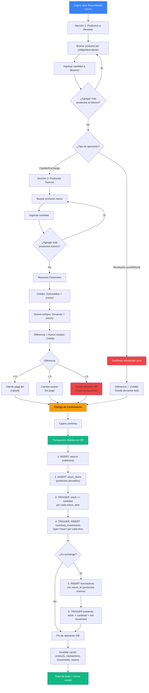
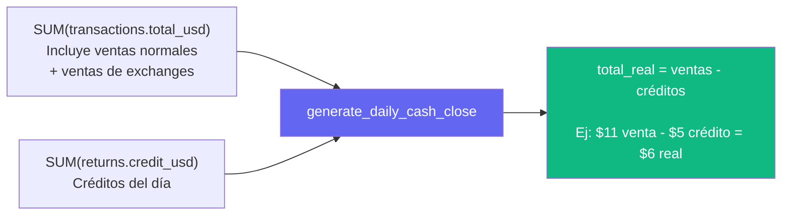

# Auditoría y Plan Arquitectónico: Módulo de Devoluciones/Cambios

---

## 1. Resumen de Hallazgos y Puntos Ciegos del Borrador

### Lo que el borrador cubre bien

- Identifica los 3 escenarios principales de negocio (cambio exacto, upsell, multi-producto).
- Reconoce la necesidad de un nuevo valor en el enum `movement_types`.
- Plantea correctamente que `generate_daily_cash_close` necesita ajuste.
- Menciona la política de negocio: no hay devolución de efectivo salvo caso excepcional.

### Puntos ciegos y gaps identificados

| #   | Punto Ciego                                                                                                                                                                                                 | Riesgo                                                                                                                                   |
| --- | ----------------------------------------------------------------------------------------------------------------------------------------------------------------------------------------------------------- | ---------------------------------------------------------------------------------------------------------------------------------------- |
| 1   | **No contempla devolución multi-producto en el lado del retorno**. Solo se asume que el cliente devuelve 1 producto. ¿Qué pasa si devuelve 2 pares distintos para llevarse 1 par más caro?                  | Modelo de datos limitado si se asume 1:N (1 retorno → N nuevos). Debe ser M:N.                                                           |
| 2   | **No define si el crédito se calcula con el precio original de venta o el precio actual del producto**. Si el producto subió de $5 a $8, ¿el crédito es $5 o $8?                                            | Discrepancia financiera y posible pérdida para el negocio.                                                                               |
| 3   | **No vincula la devolución a la transacción original**. Sin este vínculo, no hay forma de prevenir doble devolución ni de auditar.                                                                          | Vulnerabilidad a fraude interno (un empleado puede "devolver" el mismo par indefinidamente).                                             |
| 4   | **No contempla devolución parcial**. Cliente compró 3 pares iguales, quiere devolver solo 1.                                                                                                                | El sistema debe soportar cantidades menores a la venta original.                                                                         |
| 5   | **No define ventana temporal para devoluciones**. ¿Se puede devolver un producto vendido hace 6 meses?                                                                                                      | Riesgo de abuso. Recomendación: dejar flexible ahora, agregar política después.                                                          |
| 6   | **No menciona el caso "crédito > nueva compra"**. El borrador lo menciona vagamente como "flexibilidad excepcional" pero no lo modela. Cliente devuelve $10, se lleva producto de $7 y recibe $3 de vuelta. | El campo `difference` debe permitir valores negativos. (Esta es una funcionalidad exclusiva del administrador, role: admin)              |
| 7   | **No considera devolución post-cierre de caja**. Si el cierre ya se generó y luego se procesa una devolución del mismo día.                                                                                 | El cierre se recalcula con upsert, pero debe documentarse como flujo válido.                                                             |
| 8   | **No considera productos inactivos**. ¿Se puede devolver un producto que fue desactivado? El stock debe subir pero ¿se reactiva?                                                                            | Decisión de negocio: se sube stock pero no se cambia `active`.                                                                           |
| 9   | **No aborda race conditions**. Dos cajeros procesando devoluciones del mismo producto simultáneamente.                                                                                                      | El CHECK `stock >= 0` en PostgreSQL serializa implícitamente con `UPDATE`, pero los nuevos productos tomados podrían quedarse sin stock. |
| 10  | **No define la tasa de cambio a usar**. ¿Se usa la tasa vigente al momento de la devolución o la tasa de la venta original?                                                                                 | Recomendación: tasa vigente, ya que el crédito se consume inmediatamente.                                                                |

---

## 2. Diagrama de Flujo del Ciclo de Vida de una Devolución



### Diagrama de impacto en Cierre de Caja



---

## 3. Cambios Exactos Sugeridos a Nivel de Base de Datos

### 3.1 Nuevo Enum: `return_types`

```sql
CREATE TYPE return_types AS ENUM ('exchange', 'refund');
```

| Valor      | Descripción                                                  |
| ---------- | ------------------------------------------------------------ |
| `exchange` | Cliente devuelve producto(s) y se lleva producto(s) nuevo(s) |
| `refund`   | Caso excepcional: cliente devuelve y recibe dinero de vuelta |

### 3.2 Modificar Enum Existente: `movement_types`

```sql
ALTER TYPE movement_types ADD VALUE 'return';
```

| Valor    | Antes                           | Después                           |
| -------- | ------------------------------- | --------------------------------- |
| `entry`  | Entrada de inventario (restock) | Sin cambio                        |
| `exit`   | Salida por venta                | Sin cambio                        |
| `return` | —                               | **Nuevo**: entrada por devolución |

> **¿Por qué no reusar `entry`?** Porque semánticamente son operaciones distintas. Un `entry` es reposición del proveedor; un `return` es producto que vuelve del cliente. Diferenciarlos permite filtrar y reportar correctamente en la vista de Movimientos.

### 3.3 Nueva Tabla: `returns`

Cabecera que agrupa toda la operación de devolución/cambio.

```sql
CREATE TABLE public.returns (
    id              uuid        DEFAULT gen_random_uuid() PRIMARY KEY,
    type            return_types NOT NULL,
    credit_usd      numeric(12,2) NOT NULL CHECK (credit_usd >= 0),
    credit_ves      numeric(12,2) NOT NULL CHECK (credit_ves >= 0),
    difference_usd  numeric(12,2) NOT NULL DEFAULT 0,  -- positivo = cliente paga, negativo = tienda devuelve
    difference_ves  numeric(12,2) NOT NULL DEFAULT 0,
    exchange_rate   numeric(12,4) NOT NULL CHECK (exchange_rate > 0),
    user_id         uuid        NOT NULL REFERENCES public.users(id),
    date            date        NOT NULL DEFAULT (now() AT TIME ZONE 'America/Caracas')::date,
    time            time        NOT NULL DEFAULT (now() AT TIME ZONE 'America/Caracas')::time,
    created_at      timestamptz DEFAULT now(),
    notes           text        -- razón/motivo de la devolución (opcional)
);
```

**Campos calculados (no stored, se calculan en el backend):**

- `credit_usd` = Σ(return_items.price_usd × return_items.quantity)
- `credit_ves` = Σ(return_items.price_ves × return_items.quantity)
- `difference_usd` = total_nuevas_ventas - credit_usd
- `difference_ves` = total_nuevas_ventas - credit_ves

### 3.4 Nueva Tabla: `return_items`

Detalle de los productos que el cliente devuelve. Cada fila = un producto que vuelve al inventario.

```sql
CREATE TABLE public.return_items (
    id          uuid        DEFAULT gen_random_uuid() PRIMARY KEY,
    return_id   uuid        NOT NULL REFERENCES public.returns(id) ON DELETE CASCADE,
    product_id  uuid        NOT NULL REFERENCES public.products(id),
    quantity    integer     NOT NULL CHECK (quantity > 0),
    price_usd   numeric(12,2) NOT NULL CHECK (price_usd > 0),
    price_ves   numeric(12,2) NOT NULL CHECK (price_ves > 0)
);
```

> **Nota sobre `price_usd`/`price_ves`:** Se almacena el precio vigente al momento de la devolución. Esto congela el crédito y evita discrepancias si el precio cambia después.

### 3.5 Modificar Tabla: `transactions`

Agregar FK opcional hacia `returns` para vincular las ventas que son parte de un intercambio.

```sql
ALTER TABLE public.transactions
    ADD COLUMN return_id uuid REFERENCES public.returns(id);
```

| Valor de `return_id` | Significado                                                                |
| -------------------- | -------------------------------------------------------------------------- |
| `NULL`               | Venta normal (comportamiento actual, sin cambios)                          |
| UUID válido          | Esta venta es parte de un intercambio — el cliente pagó solo la diferencia |

> **Impacto en triggers existentes:** Ninguno. El trigger `process_sale_transaction` no lee `return_id`, por lo que sigue funcionando sin modificaciones. Las transacciones vinculadas a un return siguen restando stock y creando exit movements normalmente.

### 3.6 Nuevo Trigger: `process_return_item`

Se dispara al insertar un `return_item`. Realiza dos acciones atómicamente:

```
ON INSERT en return_items:
  1. UPDATE products SET stock = stock + NEW.quantity WHERE id = NEW.product_id
  2. INSERT INTO inventory_movements (type='return', product_id, quantity, user_id, date, time)
```

> **Anti-recursión:** Necesita la misma guarda `pg_trigger_depth()` que ya usan los triggers existentes, ya que el UPDATE de stock en `products` dispararía `log_product_entry`. La guarda en `log_product_entry` (`pg_trigger_depth() > 1`) ya existe y protege contra esto.

### 3.7 Modificar Función: `generate_daily_cash_close`

**Cambio clave:** Restar los créditos de devoluciones del total del día.

```
-- Agregar después del SELECT de transactions:
SELECT COALESCE(SUM(credit_usd), 0),
       COALESCE(SUM(credit_ves), 0)
INTO v_returns_usd, v_returns_ves
FROM public.returns
WHERE date = v_target_date;

-- Modificar el INSERT/upsert:
total_usd = v_total_usd - v_returns_usd,
total_ves = v_total_ves - v_returns_ves,
```

**Agregar columnas a `cash_closes` para visibilidad:**

```sql
ALTER TABLE public.cash_closes
    ADD COLUMN total_returns      integer     NOT NULL DEFAULT 0,
    ADD COLUMN total_returns_usd  numeric(12,2) NOT NULL DEFAULT 0,
    ADD COLUMN total_returns_ves  numeric(12,2) NOT NULL DEFAULT 0;
```

Así el cierre muestra:

- `total_usd` = ingreso real (ventas - créditos)
- `total_returns` = cantidad de devoluciones del día
- `total_returns_usd` = monto total de créditos (para auditoría)

### 3.8 RLS (Row Level Security)

Aplicar las mismas políticas que `transactions`:

```sql
ALTER TABLE public.returns ENABLE ROW LEVEL SECURITY;
ALTER TABLE public.return_items ENABLE ROW LEVEL SECURITY;

-- Políticas: authenticated users can SELECT/INSERT
-- (misma estructura que transactions)
```

### 3.9 Diagrama Entidad-Relación (cambios)

```
┌─────────────┐       ┌──────────────────┐       ┌─────────────┐
│  products    │◄──────│  return_items     │──────►│  returns     │
│             │  FK    │                  │  FK    │             │
│  stock +=   │       │  product_id      │       │  id          │
│  quantity   │       │  return_id       │       │  type        │
│             │       │  quantity        │       │  credit_usd  │
│             │       │  price_usd       │       │  difference_ │
│             │       │  price_ves       │       │  user_id     │
└──────┬──────┘       └──────────────────┘       └──────┬───────┘
       │                                                │
       │  FK                                      FK    │ (nullable)
       │                                                │
┌──────┴──────┐                                  ┌──────┴───────┐
│transactions │◄─────────────────────────────────│ return_id    │
│             │         (ventas de exchange)      │              │
│ return_id   │                                  └──────────────┘
│ (nullable)  │
└─────────────┘
       │
       │ trigger existente
       ▼
┌─────────────────┐
│inventory_movements│
│ type: entry/exit/ │
│       return ◄NEW │
└─────────────────┘
```

---

## 4. Plan de Implementación Paso a Paso

### Fase 1: Base de Datos (Migrations + Triggers)

| Paso | Tarea                                                                                                     | Dependencia |
| ---- | --------------------------------------------------------------------------------------------------------- | ----------- |
| 1.1  | Crear migration: `ALTER TYPE movement_types ADD VALUE 'return'`                                           | Ninguna     |
| 1.2  | Crear migration: `CREATE TYPE return_types AS ENUM ('exchange', 'refund')`                                | Ninguna     |
| 1.3  | Crear migration: `CREATE TABLE returns` con RLS                                                           | 1.2         |
| 1.4  | Crear migration: `CREATE TABLE return_items` con RLS                                                      | 1.3         |
| 1.5  | Crear migration: `ALTER TABLE transactions ADD COLUMN return_id`                                          | 1.3         |
| 1.6  | Crear migration: `ALTER TABLE cash_closes ADD COLUMN total_returns, total_returns_usd, total_returns_ves` | Ninguna     |
| 1.7  | Crear función trigger `process_return_item()` (stock + movement)                                          | 1.1, 1.4    |
| 1.8  | Modificar `generate_daily_cash_close()` para restar créditos                                              | 1.3, 1.6    |
| 1.9  | Escribir SQL tests en `supabase/tests/` para cada escenario                                               | 1.1–1.8     |

> **Recomendación:** Agrupar 1.1–1.8 en una sola migration para atomicidad. Los tests en 1.9 son archivos separados.

### Fase 2: Tipos y Service Layer

| Paso | Tarea                                                                                                                      | Dependencia |
| ---- | -------------------------------------------------------------------------------------------------------------------------- | ----------- |
| 2.1  | Regenerar tipos Supabase: `npx supabase gen types typescript`                                                              | Fase 1      |
| 2.2  | Actualizar `src/types/index.ts`: agregar `Return`, `ReturnItem`, `ReturnInsert`, `ReturnItemInsert`, `ReturnWithRelations` | 2.1         |
| 2.3  | Crear `src/services/returnsService.ts` con operación `createReturn()`                                                      | 2.2         |

**Diseño de `returnsService.createReturn()`:**

Esta función debe orquestar toda la operación en una sola llamada. Se recomienda una **función RPC de Postgres** (`process_return`) que reciba el payload completo y ejecute todo en una transacción atómica:

```
Input: {
  type: 'exchange' | 'refund',
  returned_items: [{ product_id, quantity, price_usd, price_ves }],
  new_items: [{ product_id, quantity, price_usd, price_ves, exchange_rate }] | null,
  exchange_rate: number,
  user_id: uuid,
  notes?: string
}

La función RPC:
  1. Calcula credit_usd/ves sumando returned_items
  2. Calcula new_sale_total sumando new_items (si exchange)
  3. Calcula difference = new_sale_total - credit
  4. INSERT INTO returns → obtiene return_id
  5. INSERT INTO return_items (bulk) → triggers manejan stock + movements
  6. Si exchange: INSERT INTO transactions con return_id (bulk) → triggers existentes manejan stock - movements
  7. RETURN el return completo con sus relaciones
```

> **¿Por qué una función RPC y no múltiples INSERT desde el frontend?** Porque la operación involucra 3+ tablas con triggers encadenados. Si algún paso falla (ej. stock insuficiente del producto nuevo), toda la operación debe revertirse. Una función PL/pgSQL es una transacción atómica por defecto.

### Fase 3: Hooks (React Query)

| Paso | Tarea                                                                                                    | Dependencia |
| ---- | -------------------------------------------------------------------------------------------------------- | ----------- |
| 3.1  | Crear `src/features/returns/hooks/useReturns.ts` con query key factory                                   | 2.3         |
| 3.2  | Crear `useCreateReturn()` mutation que llame a `returnsService.createReturn()`                           | 3.1         |
| 3.3  | Invalidación de cache en `onSuccess`: `['products']`, `['transactions']`, `['movements']`, `['returns']` | 3.2         |

### Fase 4: Frontend — ReturnModal

| Paso | Tarea                                                                                   | Dependencia |
| ---- | --------------------------------------------------------------------------------------- | ----------- |
| 4.1  | Agregar `isReturnModalOpen` + `setReturnModalOpen` al `useModalStore`                   | Ninguna     |
| 4.2  | Crear estructura `src/components/modals/return-modal/` siguiendo patrón de `out-modal/` | Ninguna     |
| 4.3  | Definir tipo `PendingReturn` y `PendingExchangeItem`                                    | Ninguna     |
| 4.4  | Implementar hook `usePendingReturn()` (estado local del modal)                          | 4.3         |
| 4.5  | Implementar `ReturnItemsSection` (productos a devolver)                                 | 4.4         |
| 4.6  | Implementar `ExchangeItemsSection` (productos nuevos a llevar)                          | 4.4         |
| 4.7  | Implementar `ReturnSummaryFooter` (crédito, nueva compra, diferencia)                   | 4.4         |
| 4.8  | Implementar `ConfirmReturnDialog` (diálogo de confirmación)                             | 4.5–4.7     |
| 4.9  | Implementar `useSubmitReturn()` que use `useCreateReturn()`                             | 3.2, 4.4    |
| 4.10 | Registrar atajo Ctrl+K en `_app.tsx`                                                    | 4.2         |
| 4.11 | Agregar botón "Devolución" al topbar/sidebar                                            | 4.2         |

**Estructura del ReturnModal (UX):**

```
┌─────────────────────────────────────────────────────────┐
│  Devolución / Cambio                              [X]   │
├──────────────────────────┬──────────────────────────────┤
│  Productos a Devolver    │  Productos Nuevos (opcional) │
│                          │                              │
│  [🔍 Buscar producto]    │  [🔍 Buscar producto]        │
│  [Cantidad] [+ Agregar]  │  [Cantidad] [+ Agregar]      │
│                          │                              │
│  ┌────────────────────┐  │  ┌────────────────────────┐  │
│  │ Código │ Desc │Cant│  │  │ Código │ Desc │Cant│ $ │  │
│  │ NK-39  │ Nike │ 1  │  │  │ AD-42  │ Adid │ 1  │11 │  │
│  │        │      │ 🗑 │  │  │        │      │    │ 🗑 │  │
│  └────────────────────┘  │  └────────────────────────┘  │
│                          │                              │
│  Crédito: $5.00          │  Nueva compra: $11.00        │
├──────────────────────────┴──────────────────────────────┤
│                                                         │
│  Crédito: $5.00 USD  |  Nueva compra: $11.00 USD       │
│  ─────────────────────────────────────────────          │
│  Diferencia a pagar: $6.00 USD / Bs. 270.00            │
│                                                         │
│  [Motivo (opcional): ___________________________]       │
│                                                         │
│  [ Registrar devolución ]                 Shift+Enter   │
└─────────────────────────────────────────────────────────┘
```

**Comportamiento adaptativo:**

- Si no hay productos en "Productos Nuevos" → `type = 'refund'`, la diferencia es negativa (tienda devuelve todo)
- Si hay productos en ambos lados → `type = 'exchange'`
- El botón dice "Registrar cambio" o "Registrar devolución" según el tipo
- En mobile: las dos secciones se apilan verticalmente en lugar de lado a lado

### Fase 5: Integración con Vistas Existentes

| Paso | Tarea                                                                                            | Vista afectada |
| ---- | ------------------------------------------------------------------------------------------------ | -------------- |
| 5.1  | Agregar badge `return` (color amber/warning) en columna `type` de Movimientos                    | Movimientos    |
| 5.2  | Agregar indicador visual en transacciones vinculadas a un return (ej. ícono 🔄 o badge "Cambio") | Ventas         |
| 5.3  | Mostrar `total_returns`, `total_returns_usd` en métricas del cierre de caja                      | Cierres        |
| 5.4  | Agregar fila o sección "Devoluciones del día" en el diálogo de confirmación del cierre           | Cierres        |

**Vista de Movimientos — columna `type` actualizada:**

| Badge actual   | Color                          |
| -------------- | ------------------------------ |
| Entrada        | Verde (success)                |
| Salida         | Rojo (destructive)             |
| **Devolución** | **Amarillo (warning)** ← nuevo |

**Vista de Ventas — indicador de exchange:**

- Las transacciones con `return_id IS NOT NULL` muestran un badge sutil "Cambio" junto al código del producto.
- Tooltip o expandible que muestra: "Parte de devolución #X — Crédito aplicado: $5.00".

**Vista de Cierres — métricas ampliadas:**

```
Antes:                          Después:
┌──────────┬─────────┐         ┌──────────┬─────────┐
│ Ventas   │ 15      │         │ Ventas   │ 15      │
│ Unidades │ 23      │         │ Unidades │ 23      │
│ USD      │ $450.00 │         │ Devol.   │ 2       │  ← nuevo
│ VES      │ Bs.XXX  │         │ Créditos │ -$10.00 │  ← nuevo
└──────────┴─────────┘         │ USD Neto │ $440.00 │  ← ajustado
                               │ VES Neto │ Bs.XXX  │
                               └──────────┴─────────┘
```

### Fase 6: Testing

| Paso | Tipo          | Qué probar                                                                                      |
| ---- | ------------- | ----------------------------------------------------------------------------------------------- |
| 6.1  | SQL Test      | Cambio exacto: stock sube/baja correctamente, movements creados, difference = 0                 |
| 6.2  | SQL Test      | Upsell: difference > 0, cash close refleja solo la diferencia                                   |
| 6.3  | SQL Test      | Multi-producto: 1 retorno → 5 nuevos, stock/movements correctos                                 |
| 6.4  | SQL Test      | Devolución pura (refund): stock sube, no hay transacción nueva, cash close resta                |
| 6.5  | SQL Test      | Caso excepcional: crédito > nueva compra, difference < 0                                        |
| 6.6  | SQL Test      | Cash close con mix de ventas normales + returns cuadra                                          |
| 6.7  | SQL Test      | Return de producto inactivo: stock sube, `active` no cambia                                     |
| 6.8  | SQL Test      | Race condition: INSERT return_item cuando stock del nuevo producto = 0 → CHECK falla → rollback |
| 6.9  | Frontend Test | `usePendingReturn()` hook: add/remove items, cálculo de crédito y diferencia                    |
| 6.10 | Frontend Test | `useSubmitReturn()` hook: payload correcto, invalidación de cache                               |

---

## 5. Consideraciones de Seguridad y Escalabilidad

### Seguridad

| Riesgo                                                                                            | Mitigación                                                                                                                                                                                      |
| ------------------------------------------------------------------------------------------------- | ----------------------------------------------------------------------------------------------------------------------------------------------------------------------------------------------- |
| **Fraude por devolución ficticia** (empleado registra devolución de producto que nunca se vendió) | Campo `notes` obligatorio para refunds. Auditoría vía tabla `returns` (quién, cuándo, qué). A futuro: vincular a `original_transaction_id` en `return_items`.                                   |
| **Race condition en stock**                                                                       | La función RPC de Postgres ejecuta todo en una transacción. El CHECK `stock >= 0` actúa como serialization point — si dos operaciones compiten por el último par, una falla con un error claro. |
| **Manipulación de precios**                                                                       | El precio del crédito se toma del `products.price_usd` vigente en el backend (función RPC), NO del frontend. El frontend envía `product_id` y `quantity`; el backend consulta el precio.        |
| **RLS bypass**                                                                                    | Las nuevas tablas deben tener RLS habilitado con las mismas políticas que `transactions`. La función RPC usa `SECURITY DEFINER` pero valida `auth.uid()`.                                       |

### Escalabilidad

| Aspecto                             | Evaluación                                                                                                                                                  |
| ----------------------------------- | ----------------------------------------------------------------------------------------------------------------------------------------------------------- |
| **Volumen de datos**                | Para una tienda de calzado, las devoluciones son ~5-10% de las ventas. Con 246 transacciones actuales, esto agrega ~25 returns. No es un cuello de botella. |
| **Índices recomendados**            | `returns(date)` para filtrado por fecha. `return_items(return_id)` ya cubierto por FK. `transactions(return_id)` para queries de join.                      |
| **Query performance en cash close** | Agregar un query más (returns del día) a `generate_daily_cash_close` tiene impacto negligible. Son operaciones SUM sobre un índice por fecha.               |

---

## 6. Decisiones Arquitectónicas y Justificación

| Decisión                                                             | Alternativa descartada                          | Justificación                                                                                                                                             |
| -------------------------------------------------------------------- | ----------------------------------------------- | --------------------------------------------------------------------------------------------------------------------------------------------------------- |
| Tabla `returns` separada (no reusar `transactions`)                  | Insertar transacciones con cantidades negativas | `transactions` tiene CHECK `quantity > 0` y `price > 0`. Cambiar esto rompería el modelo existente y la semántica de "transacción = venta".               |
| Función RPC en vez de múltiples INSERTs del frontend                 | Llamadas secuenciales desde el service layer    | Atomicidad. Si falla el stock del producto nuevo, todo se revierte. Sin RPC, se necesitaría implementar rollback manual en JS.                            |
| `movement_types = 'return'` (nuevo valor) en vez de reusar `'entry'` | Reusar `entry` para devoluciones                | Reportes: permite filtrar "entradas del proveedor" vs "devoluciones del cliente". El costo es un valor más en el enum, el beneficio es claridad en datos. |
| Precio vigente al momento del return (no precio original)            | Buscar transacción original y usar su precio    | Simplifica UX (no hay que buscar la venta original) y es coherente con la política de "crédito por producto, no por factura".                             |
| Sin tabla nueva de vista (5ta ruta)                                  | Crear `/returns` como vista dedicada            | Restricción explícita del usuario. Las devoluciones se visualizan en Movimientos (badge 'return') y en Ventas (badge 'cambio').                           |
| `return_id` nullable en `transactions`                               | Tabla intermedia `return_transactions`          | Más simple. Una FK nullable es suficiente y evita una tabla de join innecesaria para una relación 1:N.                                                    |

---

## 7. Permisos por Rol (Admin vs Employee)

Actualmente la app tiene dos roles (`admin`, `employee`) definidos como enum de PostgreSQL. El rol se muestra en la UI pero **no se aplica** a nivel de RLS ni de lógica de negocio — todas las políticas RLS son permisivas para cualquier usuario autenticado.

El módulo de devoluciones introduce una necesidad real de diferenciación de permisos, ya que los refunds implican salida de dinero de caja.

### Matriz de Permisos

| Acción | Admin | Employee | Justificación |
|---|:---:|:---:|---|
| Abrir ReturnModal | Si | Si | Ambos roles deben poder iniciar el flujo |
| Registrar **cambio/exchange** (difference >= 0) | Si | Si | Es la operación estándar de tienda, bajo riesgo |
| Registrar **cambio con saldo a favor** (difference < 0) | Si | No | Implica devolución parcial de efectivo — requiere aprobación |
| Registrar **devolución pura/refund** | Si | No | Implica salida total de efectivo — solo administrador |
| Ver historial de devoluciones en vistas | Si | Si | Transparencia operativa para todo el equipo |
| Anular/revertir una devolución | Si | No | Operación destructiva, solo admin (futuro) |

### Implementación de Permisos

**Nivel de Base de Datos (RLS):**

```sql
-- returns: todos pueden ver, solo admin puede crear refunds
CREATE POLICY "Authenticated users can view returns"
  ON public.returns FOR SELECT TO authenticated USING (true);

CREATE POLICY "Authenticated users can create exchanges"
  ON public.returns FOR INSERT TO authenticated
  WITH CHECK (
    type = 'exchange' AND difference_usd >= 0
    OR EXISTS (
      SELECT 1 FROM public.users
      WHERE id = auth.uid() AND role = 'admin'
    )
  );

-- return_items: sigue la política de returns (cascada)
CREATE POLICY "Authenticated users can view return_items"
  ON public.return_items FOR SELECT TO authenticated USING (true);

CREATE POLICY "Authenticated users can insert return_items"
  ON public.return_items FOR INSERT TO authenticated WITH CHECK (true);
```

> **Nota:** La validación principal ocurre en la función RPC `process_return()` que usa `SECURITY DEFINER`. Dentro de la función se valida el rol del `auth.uid()` antes de permitir refunds o diferencias negativas.

**Nivel de Frontend (UX adaptativa):**

```
ReturnModal:
  ├── Sección "Productos a Devolver" → visible para todos
  ├── Sección "Productos Nuevos" → visible para todos
  ├── Resumen financiero → visible para todos
  └── Botón "Registrar"
       ├── Si type='exchange' AND difference >= 0 → habilitado para todos
       ├── Si type='exchange' AND difference < 0 → deshabilitado para employee
       │    └── Tooltip: "Solo un administrador puede procesar cambios con saldo a favor"
       └── Si type='refund' (sin productos nuevos) → deshabilitado para employee
            └── Tooltip: "Solo un administrador puede procesar devoluciones"
```

La validación en frontend es cosmética (UX). La validación real ocurre en la función RPC y las políticas RLS.

---

## 8. Integración del ReturnModal en el Sistema de Modales

El ReturnModal debe seguir **exactamente** el mismo patrón de los modales existentes (`InModal` Ctrl+I, `OutModal` Ctrl+J). Todos los puntos de integración:

### 8.1 Zustand Store (`useModalStore.ts`)

Agregar estado para el nuevo modal:

```
isReturnModalOpen: boolean;
setReturnModalOpen: (open: boolean) => void;
```

### 8.2 Layout `_app.tsx` — Desktop

Agregar botón en el topbar junto a los existentes:

```
[Carga de Inventario Ctrl+I] [Venta Ctrl+J] [Devolución Ctrl+K]  ← NUEVO
```

Patrón exacto del botón (mismo que los existentes):
```
<Button variant="ghost" size="sm" className="hidden h-7 gap-1.5 px-2 text-xs md:inline-flex">
  <IterationCcw className="h-3.5 w-3.5" />   ← icono de Lucide para "return/undo"
  <span>Devolución</span>
  <kbd className="kbd hidden lg:inline-flex">Ctrl+K</kbd>
</Button>
```

### 8.3 Layout `_app.tsx` — Keyboard Shortcut

Agregar al handler `handleKeyDown` existente:

```
if (e.key === "k" || e.key === "K") {
  e.preventDefault();
  setReturnModalOpen(true);
}
```

### 8.4 Layout `_app.tsx` — Render del Modal

Junto a los modales existentes:

```
<InModal isOpen={isInModalOpen} onOpenChange={setInModalOpen} />
<OutModal isOpen={isOutModalOpen} onOpenChange={setOutModalOpen} />
<ReturnModal isOpen={isReturnModalOpen} onOpenChange={setReturnModalOpen} />  ← NUEVO
```

### 8.5 Bottom Bar (Mobile) — FAB Action Drawer

El drawer del FAB central (botón `+`) actualmente muestra 2 opciones. Agregar la tercera:

```
┌─────────────────────────────┐
│  ¿Qué desea hacer?          │
├─────────────────────────────┤
│  📦 Registrar Ingreso       │
│     Agregar productos       │
├─────────────────────────────┤
│  🛒 Registrar Venta         │
│     Vender un producto      │
├─────────────────────────────┤
│  🔄 Registrar Devolución    │  ← NUEVO
│     Cambio o devolución     │
└─────────────────────────────┘
```

Patrón exacto (mismo que los botones existentes):
```
<Button className="bg-card h-14 w-full justify-start gap-3 px-4 text-base"
  onClick={() => { setActionDrawerOpen(false); setReturnModalOpen(true); }}>
  <IterationCcw className="text-warning h-5 w-5" />
  <div className="flex flex-col items-start">
    <span className="text-sm font-semibold">Registrar Devolución</span>
    <span className="text-muted-foreground text-xs">Cambio o devolución de producto</span>
  </div>
</Button>
```

> **Color del ícono:** `text-warning` (amber) para diferenciar de ingreso (`text-primary`) y venta (`text-success`).

### 8.6 Mobile Menu Sheet

El menu lateral derecho (Sheet) muestra navegación secundaria. No necesita cambios ya que las devoluciones no son una ruta — son un modal accesible desde el FAB.

### 8.7 Modal Base Component

El ReturnModal debe usar `<ResponsiveModal>` (mismo que InModal y OutModal) para hereder automáticamente:
- Fullscreen en mobile (`max-h-[90dvh] w-screen rounded-none`)
- Dialog centrado en desktop con `dialogClassName="sm:max-w-5xl"` (más ancho que OutModal por tener 2 secciones)
- `avoidCloseFromOutsideClick` y `avoidCloseFromEsc` (igual que los otros modales)
- Animaciones adaptadas a mobile

---

## 9. Mejoras de Consistencia en Tablas

El módulo de devoluciones introduce nuevas tablas (dentro del modal y en las vistas existentes). Para mantener consistencia, se deben aplicar los patrones establecidos y mejorar donde sea necesario.

### 9.1 Patrones de Columnas Existentes a Respetar

| Patrón | Ejemplo | Aplicar en |
|---|---|---|
| `createColumnHelper<T>()` | Todas las columns.tsx | Columnas del ReturnModal |
| `tabular-nums` en números | Stock, precios, cantidades | Todas las columnas numéricas de returns |
| `text-right` en headers numéricos | `() => <div className="text-right">Stock</div>` | Precio, cantidad, totales |
| `max-w-table-row truncate` en descripción | `<span className="max-w-table-row block truncate">` | Descripción de producto en tablas del modal |
| `meta: { hideOnMobile: true }` | Index (#), descripción, acciones | Columnas secundarias del ReturnModal |
| `formatCurrencyUSD` / `formatCurrencyVES` | Todas las celdas de precio | Precios en tablas de return |
| Badge para tipos/estados | Entry=success, Exit=destructive | Return=warning (amber) |
| Botón de eliminar con ícono `Trash2` | `<Trash2 className="h-3.5 w-3.5" />` | Botón remover en items pendientes |
| Skeleton loading via `isLoading` prop | `<TableSkeleton>` | Todas las tablas del modal |

### 9.2 Columnas del ReturnModal — Tabla "Productos a Devolver"

| Columna | Mobile | Desktop | Alineación |
|---|:---:|:---:|---|
| # (index) | Oculta | Visible | Izquierda |
| Código | Visible | Visible | Izquierda, `font-bold uppercase` |
| Descripción | Oculta | Visible | Izquierda, `truncate max-w-40 md:max-w-60` |
| Cantidad | Visible | Visible | Derecha, `tabular-nums` |
| Precio USD | Visible | Visible | Derecha, `formatCurrencyUSD` |
| Subtotal | Oculta | Visible | Derecha, `formatCurrencyUSD` |
| Eliminar | Visible | Visible | Centro, `Trash2` icon |

### 9.3 Columnas del ReturnModal — Tabla "Productos Nuevos"

Misma estructura que la tabla del OutModal para consistencia visual:

| Columna | Mobile | Desktop | Alineación |
|---|:---:|:---:|---|
| # (index) | Oculta | Visible | Izquierda |
| Código | Visible | Visible | Izquierda, `font-bold uppercase` |
| Descripción | Oculta | Visible | Izquierda, `truncate` |
| Cantidad | Visible | Visible | Derecha, `tabular-nums` |
| Precio USD | Visible | Visible | Derecha, `formatCurrencyUSD` |
| Total USD | Visible | Visible | Derecha, `formatCurrencyUSD` |
| Eliminar | Visible | Visible | Centro |

### 9.4 Columna `type` en Vista de Movimientos — Actualización

Agregar el tercer badge para el nuevo valor del enum:

```
entry  → Badge variant="success"     → texto "Entrada"
exit   → Badge variant="destructive" → texto "Salida"
return → Badge variant="warning"     → texto "Devolución"   ← NUEVO
```

### 9.5 Columna nueva en Vista de Ventas

Para transacciones vinculadas a un return (`return_id IS NOT NULL`), agregar indicador visual:

Opción recomendada: badge inline junto al código del producto.

```
| Código         | Descripción | Cant | ...
| NK-39 [Cambio] | Nike Air... | 1    | ...    ← badge sutil "Cambio"
| AD-42          | Adidas...   | 2    | ...    ← venta normal, sin badge
```

El badge usa `variant="outline"` con borde amber para no competir visualmente con los datos.

---

## 10. Responsividad Completa

### 10.1 ReturnModal — Layout Adaptativo

**Desktop (>= 768px):**
```
┌──────────────────────────────────────────────────────────────────┐
│  Devolución / Cambio                                        [X]  │
├───────────────────────────────┬──────────────────────────────────┤
│  Productos a Devolver         │  Productos Nuevos (opcional)     │
│  grid-cols-2 side by side     │                                  │
│  ...                          │  ...                             │
├───────────────────────────────┴──────────────────────────────────┤
│  Footer: Crédito | Nueva compra | Diferencia | [Registrar]      │
└──────────────────────────────────────────────────────────────────┘
```

**Mobile (< 768px):**
```
┌──────────────────────────────┐
│  Devolución / Cambio    [X]  │
├──────────────────────────────┤
│  [Tab: Devolver | Nuevos]    │  ← Tabs en vez de side-by-side
│                              │
│  Contenido del tab activo    │
│  (fullscreen, scroll)        │
│                              │
├──────────────────────────────┤
│  Crédito: $5.00              │
│  Nueva compra: $11.00        │
│  Diferencia: $6.00           │
│  [Registrar devolución]      │
└──────────────────────────────┘
```

**Decisión clave para mobile:** Usar **Tabs** (`<Tabs>`) en vez de dos columnas side-by-side. Esto es consistente con el InModal que ya usa tabs (Alt+N / Alt+E) para alternar entre "Nuevo Producto" y "Aumentar Existencia".

### 10.2 Clases Responsive Requeridas

| Elemento | Mobile | Desktop |
|---|---|---|
| Layout de secciones | `flex flex-col` (stacked via tabs) | `grid grid-cols-2 gap-4` |
| Modal width | `w-screen max-w-none rounded-none` (via ResponsiveModal) | `sm:max-w-5xl` |
| Formulario de búsqueda | Full width | Inline con botón |
| Tabla de items pendientes | Columnas reducidas (hideOnMobile) | Todas las columnas |
| Footer de resumen | Stack vertical, texto más pequeño | Horizontal, badges grandes |
| Botón registrar | Full width `w-full` | `w-auto` alineado a la derecha |
| Campo motivo/notes | Full width, debajo del resumen | Inline con el resumen |
| Diálogo confirmación | Sheet/Drawer desde abajo | AlertDialog centrado |

### 10.3 Atajos de Teclado (solo Desktop)

| Atajo | Acción | Contexto |
|---|---|---|
| `Ctrl+K` | Abrir ReturnModal | Global (registrado en `_app.tsx`) |
| `Shift+Enter` | Enviar formulario del modal | Cuando ReturnModal está abierto y hay items |
| `Tab` / `Shift+Tab` | Navegación entre campos | Dentro del modal |
| `Enter` | Agregar item al batch | Dentro del formulario de búsqueda |

> Los atajos de teclado se muestran con `<kbd>` solo en desktop (`hidden lg:inline-flex`), consistente con el patrón existente.

---

## 11. Best Practices Aplicables

### 11.1 React Query (TanStack Query)

- **Query key factory** para returns, siguiendo el patrón existente:
  ```
  returnKeys = {
    all: ["returns"],
    lists: () => [...returnKeys.all, "list"],
    list: (date?: string) => [...returnKeys.lists(), { date }],
  }
  ```
- **Invalidación selectiva** en `onSuccess` del mutation: invalidar solo las keys afectadas (`products`, `transactions`, `movements`), no usar `queryClient.invalidateQueries()` global.
- **Optimistic updates** no recomendados aquí: la operación es compleja (multi-tabla) y el rollback sería frágil. Usar loading state con toast.

### 11.2 TanStack Table

- Definir columnas fuera del componente (archivo `columns.tsx` separado) para evitar re-renders.
- Usar `meta: { hideOnMobile: true }` en columnas secundarias (no usar CSS `hidden md:table-cell` directo).
- Usar `createColumnHelper<T>()` con tipos estrictos, no `ColumnDef<any>`.

### 11.3 TanStack Form

- Usar `useAppForm` hook existente para los formularios dentro del modal.
- Validación `onChange` (no `onBlur`) para feedback inmediato — consistente con OutModal.
- Resetear formulario después de agregar item al batch, mover foco al campo de búsqueda.

### 11.4 Supabase / PostgreSQL

- La función RPC `process_return()` debe ser `SECURITY DEFINER` con validación explícita de `auth.uid()`.
- Usar `pg_trigger_depth()` en el nuevo trigger `process_return_item` para evitar recursión con `log_product_entry`.
- Índice en `returns(date)` para queries del cierre de caja.
- Índice en `transactions(return_id)` para JOIN eficiente al mostrar badge "Cambio".

### 11.5 React Performance (React Compiler)

- El React Compiler (babel-plugin-react-compiler) ya está activo para `src/`. Los componentes del ReturnModal se benefician automáticamente.
- Componentes de celda de tabla (ej. `PriceBsCell`) deben ser componentes separados (no lambdas inline) para que el compiler los optimice.
- Memoizar cálculos derivados del estado pendiente (crédito total, diferencia) con `useMemo`, consistente con `usePendingSales`.
